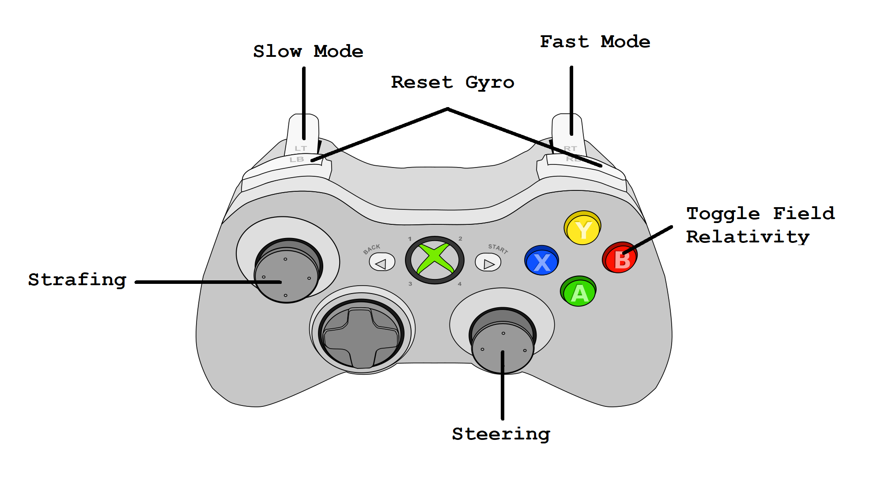
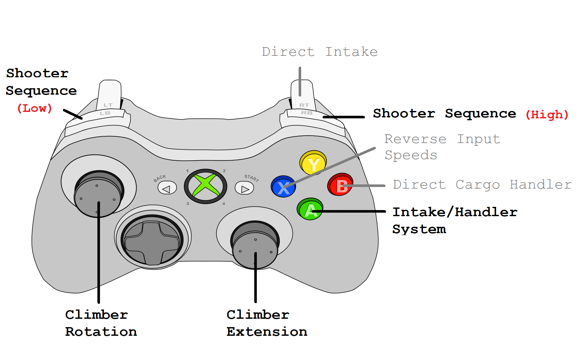

# Robot Controls System Data Sheet
## Initialization Steps
1. Run the climber initialization command
   - Fully extend the climber (in both rotation and extension) before running the command
   - Do this in the pit before loading
2. Set up the autonomous path
   - Place the robot on the field according to the autonomous path's intialization description
   - Select the autonomous mode on the dashboard along with the autonomous waiting period duration
3. Remove hooks from the climbers and handles from the bumpers
4. Ensure the driver station is prepared for the match
   - The dashboard cameras should be visible
   - The correct tab must be selected
   - The FRC driver station app must be visible at the bottom of the screen
   - The controllers must have the correct IDs in the driver station app (drive controller is 0, central controller is 1)
5. \[Additional steps to initialize the robot]

## Controls
### Drive Controller

Slow mode and fast mode speed up the movement controls on the robot's swerve drive. In fast mode, the speed
is fast enough for strafing and steering to conflict at max speeds, meaning that if you start turning at max
speed your strafing speed may decrease. Fast mode is best used if you need to either *only turn* or *only strafe*
very quickly.

### Central Controller

When the climber begins to hit the "invisible ceiling" (preventing the climber from reaching out of the legal bounds
of the robot), the controller will vibrate. The reverse input speeds button will only reverse the speeds of systems when
they are controlled by one of the gray inputs (direct shooter, direct intake, and direct cargo handler). Because the grayed
inputs are more "direct," it is recommended that they are used sparingly because many of the systems are automated with the
black inputs.

## Auton Paths
### AutoTaxi
Moves out of the tarmac.

- Initial Position: The robot can be positioned in any way such that the shooter initially faces the hub.

### AutoLowGoalTaxi
Shoots a single cargo ball into the hub, and then performs `AutoTaxi`, moving out of the tarmac.

- Initial Position: The robot can be positioned in any way such that it can immediately shoot into the hub.

### AutoTwoBallSensor
Shoots a single cargo ball into the hub, then drives away from the hub, running the intake and cargo handler
until a ball is detected. Once a ball is detected, it drives directly back to the hub and shoots the second ball.

- Initial Position: The robot can be positioned in any way such that it can immediately shoot into the hub and
would run over the second ball if it were to drive directly away from the hub.

- Functional Notes: The ball is detected through measuring changes in the cargo handler's torque, so if something
comes into contact with the cargo handler this auton may not function properly.

- Usage Notes: The auton will drive and search for a cargo ball for a maximum of 8 seconds before it turns around.
Also, it may take a fraction of a second after the ball passes through intake before it is detected--for this reason,
this auton isn't a good option if the robot needs to turn around precisely when the cargo passes through intake. **In
the case that the robot is positioned on the part of the tarmac where the wall is directly behind the second ball it
will attempt to intake, `AutoTwoBallWall` is recommended instead.**

### AutoTwoBallWall
Shoots a single ball into the hub, drives away, turns and picks up a ball, turns back, and shoots.

- Initial Position: The robot should be positioned such that it is squared against the hub, with the shooter-side bumper
being about five inches away (the shooter faces the hub).

- Usage Notes: While this auton is a good option when `AutoTwoBallSensor` isn't available due to the wall being too close
to the second ball, otherwise, `AutoTwoBallSensor` should be used. See `AutoTwoBallSensor`'s usage notes for distinguishing
between when to use `AutoTwoBallWall` versus `AutoTwoBallSensor`.

### AutoTrifecta
Not currently functioning, but meant to shoot a single ball into the hub, drive back, pick up two more, then shoot them both.

- Initial Position: The robot should be positioned such that it is squared against the hub, with the shooter-side bumper
being about five inches away (the shooter faces the hub).

- Functional Notes: This auton can take around 13 to 14 seconds in total, so `AutonWaitPeriod` should be set to zero whenever
it is used.

- Usage Notes: Not currently functioning. Also tends to accumulate a decent amount of positional error over time as slight
errors in the auton paths compound and have the potential to make the final path unreliable.

## RoboRIO Inputs and CAN
\[CAN and additional input information here]

## Usage Notes
\[Usage notes here]