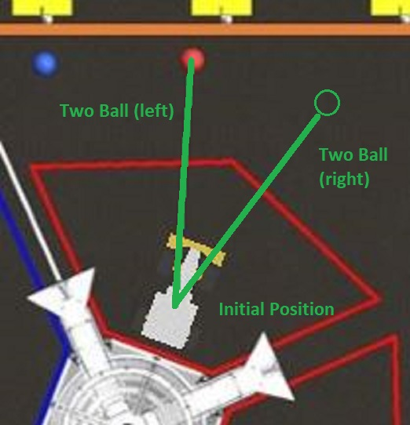
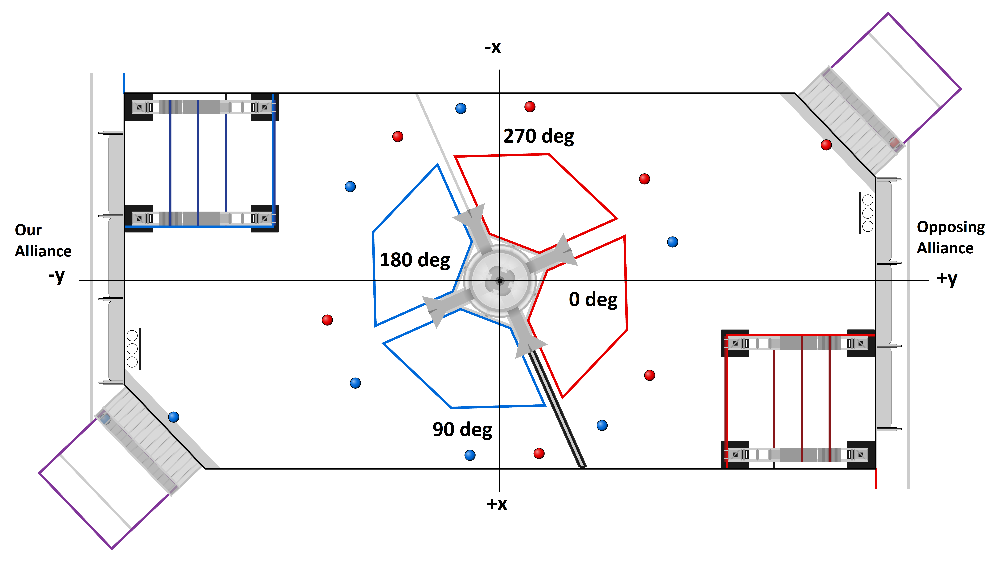

# Robot Controls System Data Sheet for Euphrosyne
Updated 9/15/2022 at 5:50 PM.

## Initialization Steps
1. Run the climber initialization command, found on the dashboard: `Control Board > Climber Initialization`.
   - Fully extend the climber (in both rotation and extension) before running the command
   - Do this in the pit before loading
2. Set up the autonomous path
   - Look up autonomous paths in this data sheet to find one that suits our strategy
   - Place the robot on the field according to the autonomous path's intialization description
   - Select the autonomous mode on the dashboard: `Main Board > Auton Selector`.
   - Set the waiting period duration on the dashboard: `Main Board > Auton Wait Period`.
3. Remove hooks from the climbers and handles from the bumpers
4. Ensure the driver station is prepared for the match
   - The dashboard cameras should be visible
   - The "Main Board" must be selected on the dashboard
   - The FRC DriverStation must be visible at the bottom of the screen
   - The controllers must have the correct IDs in the driver station app (drive controller is 0, central controller is 1)

## Controls
### Drive Controller
Slow mode and fast mode speed up the movement controls on the robot's swerve drive. In fast mode, the speed
is fast enough for strafing and steering to conflict at max speeds, meaning that if you start turning at max
speed your strafing speed may decrease. Fast mode is best used if you need to either *only turn* or *only strafe*
very quickly.

In outreach safety mode (`Control Board > Outreach Safety Mode`), you cannot reset the gyro, change speed modes, or toggle field relativity.

### Central Controller
When the climber begins to hit the "invisible ceiling" (preventing the climber from reaching out of the legal bounds
of the robot), the controller will vibrate. The reverse input speeds button will only reverse the speeds of systems when
they are controlled by one of the gray inputs (direct shooter, direct intake, and direct cargo handler). Because the grayed
inputs are more "direct," it is recommended that they are used sparingly because many of the systems are automated with the
black inputs.

In outreach safety mode, press Y to brake.

## Auton Paths
Autonomous paths can be selected on the dashboard using `Main Board > Auton Selector`. Note that this selector can often default to
do nothing, so this should be checked before every match.

Additionally, a waiting period before an autonomous path runs can be provided. This defaults to 0 seconds, but should still be
checked before every match. Go to `Main Board > Auton Wait Period` to specify the amount of time the robot should do nothing
before beginning the selected autonomous path. This field is measured in seconds.

### AutoTaxi: Taxi only
The robot will simply move forwards 90 inches (forwards is in the direction of the intake, see
[robot orientation details](#robot-orientation)).

- Initial Position: The robot can be positioned in any way such that the shooter initially faces the hub.

### AutoLowGoalTaxi: Low goal taxi
Shoots a single cargo ball into the lower goal of the hub, and then performs the `AutoTaxi` path, moving out of the tarmac.

- Initial Position: The robot can be positioned in any way such that it can immediately shoot into the lower hub.

### AutoHighGoalTaxi: High goal taxi
Performs the `AutoTaxi` path, moving out of the tarmac, then shoots a single cargo ball into the upper goal of the hub.

- Initial Position: The robot should be positioned so that the shooter initially faces the hub and so that, when the robot
drives 90 inches forwards (in the direction of the intake) a view of the retroreflective tape and a clear shot to the high goal
will not be obstructed by the arms of the hub.

### AutoTwoBallLow: Two ball low (right | left) 
Shoots a ball into the low goal immediately, picks up the nearest ball on the field, and returns to the robot's starting position to
shoot the second ball into the low goal.

- Initial Position: The robot must be positioned square to the hub such that the rear bumper is centered on a side of the square
forming the base of the hub, with a four inch gap between the robot and the hub.

- Usage Notes: There are actually two separate options for this command under `Main Board > Auton Selector`: "two ball low (right)" and
"two ball low (left)". The options are named after the position of the ball on the field, based on the robot's point of view.

Below shows the initial position of the robot on the field, along with its path to the ball on the field:

### AutoTwoBallHigh: Two ball high (right | left) 
Picks up the nearest ball on the field and immediately shoots into the high goal.

- Initial Position: The robot must be positioned square to the hub such that the rear bumper is centered on a side of the square
forming the base of the hub, with a four inch gap between the robot and the hub.

- Usage Notes: There are actually two separate options for this command under `Main Board > Auton Selector`: "two ball high (right)" and
"two ball high (left)". The options are named after the position of the ball on the field, based on the robot's point of view.

For a visual of the robot's initial position on the field, see [two ball low](#autotwoballlow:-two-ball-low-(right-|-left)).

## Robot Device IDs
### CAN
1. Front left drive
2. Front left steering
3. Front right drive
4. Front right steering
5. Rear left drive
6. Rear left steering
7. Rear right drive
8. Rear right steering
9. Front left steer encoder
10. Front right steer encoder
11. Rear left steer encoder
12. Rear right steer encoder
13. Intake motor
14. Lower shooter
15. Upper shooter
16. Climber rotation
17. Climber extension
18. Cargo handler pulley

### DIO
0. Right rotation limit switch
1. Left rotation limit switch
2. Right extension limit switch
3. Left extension limit switch
4. Proximity sensor (in upper cargo handler)
5. Ball detection limit switch (in lower cargo handler)

## Teleoperated Driving
### High Goal Shooting
High goal shooting requires slightly more work than low goal shooting. Firstly, before a driver runs the high goal shooter sequence,
the robot must be positioned roughly halfway between the arms of the hub. The arms of the hub can both block a shot and
obscure the retroflective tape (the vision target), which can potentially lead to both a blocked shot and an inaccurate reading
on the center of the hub, which could affect the vision-measured distance to the hub and the direction the robot will face while
shooting.

Secondly, the robot should remain absolutely still while shooting into the high goal. If another robot is pushing our robot around
while we want to shoot high, it is not worth attempting to run the high goal shooter sequence. Simply move to the hub and shoot into
the low goal if this is the case.

### Field and Robot Relativity Toggling
During the match, it may be useful to toggle field-relative robot movement. The [drive controller](#drive-controller) can
do this with the push of a button. It is important to keep this button in mind, because if it is pushed accidentally it will
make teleop control extremely difficult.

While most of the time field-relative movement is most helpful, robot-relative movement can be useful if you want to drive while
using the camera feed visible on the dashboard under the `Main Board` tab. To ensure you know exactly when the robot is in
field-relative driving mode vs. robot-relative driving mode, there is an indicator light on the dashboard. If the
`Main Board > Field Relative` display is green, then the robot is in field-relative mode. If the indicator is red, then
the robot is in robot-relative mode.

## Orientation and Odometry
### Robot Orientation
The robot's intake is considered to be at the front of the robot, and the shooter and limelight
considered to be at the back.

### Odometry
The location (0, 0) is considered to be in the very center of the field (in the middle of the hub). The x-axis is
parallel to our driver station wall, with +x being to the right of our driver station. The y-axis is perpendicular to
the driver station wall, with +y extending forward relative to the drivers.

Additionally, a direction of 0 degrees would be equivalent to our robot facing the opposing alliance's driver station,
where the intake is considered to be the front of the robot. Direction increases as the robot turns clockwise. See the image
below. **Note: odometry measurements of direction are completely separate from the gyro reset functionality used to help
in teleop driving. Manually resetting the gyro in teleop will not affect field odometry.**

